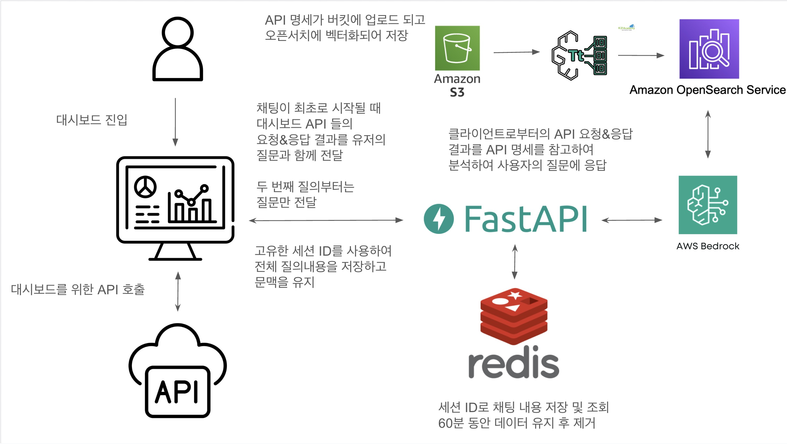

<table style="border: none; width: 100%; margin-bottom: 24px;">
<tr style="border: none;">
<td style="border: none; width: 110px; vertical-align: top;">

</td>
<td style="border: none; vertical-align: middle; padding-left: 12px;">

김재욱 ✨

Backend · AI Engineer

</td>
</tr>
</table>

## **AI 기반 백엔드·인프라 설계에 강점을 가진 엔지니어입니다 ⚙️**
실제 업무 데이터를 기반으로 한 **AI 기능 설계·구현**, AWS 환경에서의 **백엔드·인프라 구조 설계**, OpenSearch·Bedrock 기반의 **의미 검색·입력자동화·RAG 시스템** 구축에 강점을 갖고 있습니다.

서비스 운영 중 발생하는 문제를 해결하고 개선하기 위해 아키텍처 재설계, 데이터 구조 조정, 프롬프트 최적화 등을 수행하며 실제 처리 속도 **40% 단축**, 응답 품질 향상, 중복 사례 제거 등 업무 효율을 직접 개선하는 결과를 만들어왔습니다.

 

## **함께 성장하는 팀을 중요하게 생각합니다. 🤝**
기술적 판단 근거를 투명하게 공유하고, 시스템 전반의 품질을 높이기 위한 문서화·지식 전파에 적극적으로 참여하고 있습니다.

 

## About

<table style="width:100%;border:none">
<tr style="border:none;">
<td style="border:none;vertical-align:top;width:50%;">

📅&nbsp;1994년생 (만 31세)

📧&nbsp;woogiereal@gmail.com

📱&nbsp;010-7232-5609

</td>
<td style="border:none;vertical-align:top;width:50%;">

💼&nbsp;<a href="https://github.com/woogieReal">GitHub</a>

📄&nbsp;정보처리기사 / JLPT N1 / TOEIC 890

📍&nbsp;경기도 고양시 일산동구

</td>
</tr>
</table>

 

## Skills

<table style="width:100%;border:none">

<tr style="border:none;">
<td style="border:none;vertical-align:top;width:50%;">
<h3 style="margin:4px 0;">🖥 Backend</h3>
<ul style="margin:4px 0;padding-left:16px;">
<li style="margin:2px 0;">Python · Node.js · Java</li>
<li style="margin:2px 0;">Flask · FastAPI · InversifyJS</li>
</ul>
</td>

<td style="border:none;vertical-align:top;width:50%;">
<h3 style="margin:4px 0;">☁ Infra / Cloud</h3>
<ul style="margin:4px 0;padding-left:16px;">
<li style="margin:2px 0;">AWS Lambda · API Gateway · S3 · OpenSearch · Bedrock</li>
<li style="margin:2px 0;">CloudFormation · IAM · VPC/Subnet · Security Group · EventBridge</li>
</ul>
</td>
</tr>

<tr style="border:none;">
<td style="border:none;vertical-align:top;width:50%;">
<h3 style="margin:4px 0;">🔧 DevOps</h3>
<ul style="margin:4px 0;padding-left:16px;">
<li style="margin:2px 0;">Docker · GitHub Actions · Jenkins (CI/CD)</li>
<li style="margin:2px 0;">CloudWatch Logs · EventBridge</li>
</ul>
</td>

<td style="border:none;vertical-align:top;width:50%;">
<h3 style="margin:4px 0;">💾 Database</h3>
<ul style="margin:4px 0;padding-left:16px;">
<li style="margin:2px 0;">MySQL · Redis · DynamoDB</li>
<li style="margin:2px 0;">Stored Procedure · Trigger · Event Scheduler · SQL 성능 최적화</li>
</ul>
</td>
</tr>

</table>

  

# 1. 고객 불편사항 관리 시스템 AI 서비스 신규 개발 (2025.05 ~ 2025.09)
## 1.1. 개요
- **프로젝트 유형:** 대규모 고객 불편사항 관리 시스템의 AI 서비스 신규 기능 개발  
- **참여 인원:** 4명 (백엔드 겸 프론트엔드 2명, 기획 겸 퍼블리싱 1명, PM 1명)  
- **담당 역할:** 기능 구현 및 AWS 인프라 설계 담당  
  - 신규 기능 구현 및 백엔드·프론트엔드 개발 수행  
  - 서비스 운영에 필요한 AWS 리소스 검토 및 생성 (Lambda, S3, OpenSearch, Bedrock 등)  
  - 기술 검토 및 세부 개발 항목 분석을 통한 작업 일정과 리소스 생성 계획 수립  
- **기술 스택:**  
  - **인프라:** AWS(OpenSearch, Bedrock, CloudFormation, CloudWatch, Lambda, EventBridge, DynamoDB, Aurora MySQL, Systems Manager Parameter Store, IAM)  
  - **백엔드:** InversifyJS, TypeScript, AWS SDK  
  - **프론트엔드:** React, TypeScript  

 

## 1.2. 프로젝트 설명
본 프로젝트는 다수의 고객 불편사항을 관리하는 시스템에 AI 기능을 신규 도입한 사례로,  
**① 유사사례 검색**과 **② 입력자동화** 기능 개발을 중심으로 진행되었다.  

### ① 유사사례 검색
서비스 운영 중 누적된 불편사항 데이터에서 의미적으로 유사한 사례를 효율적으로 탐색하기 위해 설계하였다.  
기존 키워드 기반 검색의 한계를 보완하기 위해 **Amazon OpenSearch**를 활용한 **텍스트 임베딩 기반 의미 유사도 검색 기능**을 구축하였다.  
또한, 유사사례의 개선 요청 내용을 LLM과 결합하여 **자동 개선 요청문 생성 기능**을 구현하였다.  

### ② 입력자동화
불편사항 등록 시 선택해야 하는 항목이 많아 작성 과정이 복잡했던 문제를 해결하기 위해 개발되었다.  
고객의 불편사항과 함께 코드값 및 입력 가이드를 LLM에 전달하여, 모델이 적절한 입력 항목을 자동으로 완성하도록 설계하였다.  

 

## 1.3. 담당 업무
- **유사사례 검색 기능 구현:**  
  - Amazon OpenSearch의 벡터 검색 기능을 활용하여 기존 데이터와 신규 입력 데이터를 비교  
  - 유사도 기반으로 기존 불편사항을 자동 조회하고 중복 등록을 방지하는 기능 개발  

- **자동 개선 요청문 생성:**  
  - Bedrock LLM(Claude 계열 모델)을 이용해 담당자가 입력한 불편사항과  
    유사사례의 개선 요청 내용을 함께 활용하여 자동 개선 요청문을 생성하는 기능 개발  

- **입력 항목 자동 추천:**  
  - 고객 불편사항 입력 시 필요한 코드값 정보와 관리자가 작성한 입력 가이드를 함께 LLM에 전달  
  - 모델이 적절한 입력 항목을 자동으로 선택하고 작성하도록 기능을 개발  

 

## 1.4. 기술적 특징

- **유사사례 검색 기능 구현:**  
  - OpenSearch의 **KNN 벡터 검색**과 **BM25 키워드 검색**을 결합한 **하이브리드 유사도 검색 방식** 적용  
  - KNN 검색을 통해 불편사항 간 의미적 유사도를 계산하고, BM25 검색으로 입력 항목(부서, 유형 등)의 필드 매칭 여부를 반영  
  - 두 검색 결과의 점수를 **KNN 70% / BM25 30% 비율로 가중 합산**하여 최종 유사도 산정  
  - BM25 점수는 검색 필드 개수에 따라 **균등 분배 방식**으로 계산하여 검색 품질을 안정적으로 유지  

 

- **자동 개선 요청문 생성:**  
  - 사용 중인 LLM의 파라미터(temperature, maxTokens, 모델 ARN 등)를 별도 DB 테이블에서 관리  
  - 운영 환경에 따라 모델 설정을 유연하게 변경할 수 있도록 설계  
  - 계열사별 프롬프트 템플릿을 개별적으로 관리하여 서비스 특성에 맞는 개선문 생성 지원  
  - 프롬프트 최적화를 통해 **Claude 3 Haiku 모델**만으로도 충분한 품질의 결과를 확보  

 

- **입력 항목 자동 추천:**  
  - 항목별 코드 목록과 선택 가이드를 LLM에 전달하여 모델이 항목 단위로 정밀하게 값을 추론하도록 개선  
  - 계열사별 항목 구성이 상이하므로 **항목별·계열사별 프롬프트 개별 관리 구조**를 도입  
  - 경량화된 프롬프트를 **Claude 3 Haiku 모델**로 병렬 호출하여 처리 속도를 약 **20초 → 12초**로 단축  
  - 모델 사용 비용을 대폭 절감하고 효율적 운영 구조 확보  

 

## 1.5. 문제 해결 및 인사이트
입력 항목 자동 추천 기능의 초기 버전은 **Amazon Bedrock Knowledge Bases** 기반 RAG 구조로 설계되었으나,  
운영 과정에서 **정형화된 코드 데이터**(Key-Value 구조)를 임베딩 형태로 처리하는 데 한계가 있었다.  
Knowledge Bases는 데이터를 **라인 단위로 벡터화**하기 때문에  
코드 ID와 코드명이 서로 연관된 개념으로 저장되지 않아 모델이 관계를 올바르게 인식하지 못했다.  
또한 키워드 중심 데이터는 **언어적 맥락이 부족**해 의미적 유사도 계산만으로는 정확한 매칭이 어려웠다.  

이 문제를 해결하기 위해 **항목별 LLM 직접 호출 방식**으로 아키텍처를 개편하였다.  
각 항목별 코드 목록과 선택 가이드를 모델에 함께 전달함으로써,  
LLM이 실제 업무 문맥 속에서 항목 간 관계를 파악하고 적절한 코드를 추론할 수 있도록 개선하였다.  
이 과정에서 **코드 검증·다국어 처리·계열사별 항목 구성**을 고려한  
**동적 프롬프트 관리 체계**를 구축하여 유지보수성과 정확도를 모두 향상시켰다.  

이 경험을 통해 **정형 데이터와 언어 모델의 결합 한계**를 실무적으로 인식하였고,  
데이터 구조에 따라 검색 방식과 모델 호출 전략을 구분해야 함을 명확히 체득하였다.  

 

## 1.6. 결과 및 회고
**유사사례 검색 기능**을 통해 불편사항의 중복 등록을 방지하고,  
담당자가 이전 사례를 참고하여 개선안을 빠르게 도출할 수 있게 되었다.  
또한 **입력자동화 기능**을 통해 입력 프로세스의 복잡성이 완화되고,  
담당자의 검증 부담이 줄어 전체 처리 효율이 향상되었다.  

이 프로젝트를 통해 **AI 모델의 성공적인 도입은 단순한 기술 적용이 아니라,  
데이터 구조와 서비스 맥락에 맞춘 설계·조정 과정에 달려 있다**는 점을 명확히 인식하였다.  

  

# 2. 대시보드 RAG 기반 AI 챗봇 개발 (2025.03)
## 2.1. 개요
- **프로젝트 유형:** 멤버십 관리자 대시보드용 RAG AI 챗봇 개발  
- **참여 인원:** 3명 (백엔드 1명, 프론트엔드 1명, 퍼블리싱 1명)  
- **담당 역할:** 백엔드 및 AI 응답 처리 로직 설계 및 구현  
  - AWS Bedrock을 활용한 사용자 질의 응답 처리 API 개발  
  - OpenAPI 3.0 명세를 기반으로 한 Knowledge Base 구축  
  - Redis를 이용한 세션 관리 및 질의 문맥 유지 처리 구현  
- **기술 스택:**  
  - **인프라:** AWS(OpenSearch, Bedrock, S3), Redis  
  - **백엔드:** FastAPI, Python, AWS SDK  
  - **프론트엔드:** Nextjs, TypeScript 

 

## 2.2. 프로젝트 설명
본 프로젝트는 멤버십 관리자 대시보드 내 데이터를 보다 쉽게 활용하기 위한 **AI 챗봇**을 개발한 사례이다.  
대시보드에는 다양한 통계, 그래프, 표 형태의 마케팅 분석 데이터가 제공되지만,  
이용자가 직접 데이터를 해석하고 분석해야 하는 비효율성이 있었다.  

이에 따라 사용자가 자연어로 질문하면 챗봇이  
대시보드의 데이터를 기반으로 의미 있는 분석 결과를 제공하도록 설계하였다.  
챗봇은 API 명세 문서를 기반으로 각 데이터의 의미와 응답 형식을 이해하고,  
사용자의 질문을 분석하여 **적절한 API 요청을 구성하고 결과를 해석하여 응답**한다.

전체 구조는 다음과 같다:  
- API 명세는 OpenAPI 3.0 형식으로 작성되어 S3 버킷에 업로드되며,  
  Amazon OpenSearch에 벡터화되어 저장된다.  
- 사용자의 첫 질의 시 대시보드의 API 응답 데이터를 함께 전달받아,  
  질의·응답 문맥을 Redis에 세션 단위로 저장한다.  
- 이후 FastAPI 서버가 AWS Bedrock과 통신하여  
  OpenSearch에 저장된 API 명세를 참조해 사용자의 질문에 대한 응답을 생성한다.  
- 세션 정보는 Redis에 저장되며, **60분 동안 유지 후 자동 삭제**된다.

 

## 2.3. 담당 업무
- **API 아키텍처 설계 및 구현:**  
  - FastAPI 기반으로 챗봇 API 서버 설계 및 엔드포인트 구현  
  - API 호출, 세션 관리, 문맥 유지, 사용자 입력 처리 구조 개발  
- **Knowledge Base 구축:**  
  - OpenAPI 3.0 형식으로 작성된 API 명세를 준비
  - Amazon S3 업로드 → OpenSearch 벡터화 저장  
- **AI 응답 처리 로직 설계:**  
  - AWS Bedrock의 Claude 모델을 이용하여  
    사용자의 질문과 API 명세 간의 연관성을 분석하고 응답 생성  
  - Redis를 활용해 세션별 질의·응답 히스토리 관리 및 문맥 유지  
- **성능 및 운영 개선:**  
  - AI 챗봇 호출 횟수를 제한함으로써 과도한 비용이 발생하지 않도록 처리
  - Redis TTL(Time To Live) 설정을 통해 불필요한 세션 메모리 관리  

 

## 2.4. 기술적 특징

- **Bedrock + OpenSearch 기반의 RAG 구조 구현:**  
  OpenAPI 명세를 벡터화하여 Amazon OpenSearch에 저장하고,  
  Bedrock LLM이 이를 참조해 응답을 생성하는 Retrieval-Augmented Generation 구조를 구축  
- **세션 기반 문맥 관리:**  
  Redis를 사용하여 각 세션 ID별로 질의·응답 이력을 저장하고  
  사용자의 대화 흐름을 유지함으로써 문맥 인식이 가능한 챗봇 구현  
- **모듈형 FastAPI 구조:**  
  챗봇, 세션, 검색, 응답 생성을 독립 모듈로 구성해  
  유지보수성과 확장성을 높임  

 

## 2.5. 문제 해결 및 인사이트
- **세션 문맥 손실 문제:**  
  Redis TTL이 너무 짧게 설정되어 문맥이 끊기는 현상이 발생함.  
  → 해결: TTL을 60분으로 확장하고, 세션별 키 생성 규칙을 통합하여 유지성 강화.  
- **챗봇 용도 제한 문제:**  
  사용자가 대시보드 분석 외의 질문을 입력할 경우, 모델이 일반 대화로 인식해 불필요한 응답을 생성하는 문제가 있었다.
  → 해결: 프롬프트에 대시보드 데이터 분석 관련 질문만 응답하도록 제한 규칙을 추가해 목적 외 사용을 방지하였다.

이 과정을 통해 **LLM 기반 API 어시스턴트 구조의 핵심은 데이터 구조화와 문맥 관리**에 있음을 체감하였다.  

 

## 2.6. 결과 및 회고
본 프로젝트를 통해 대시보드 내 데이터를 자연어로 조회·분석할 수 있는 인터페이스를 구축하였다.  
챗봇은 실제 운영 환경에서 사용자의 질문에 평균 3초 이내로 응답하였으며,
더 좋은 품질의 응답 결과를 위해 프롬프트 조정과 모델 변경 등의 작업을 수행하였다.

이 경험을 통해 **AI 챗봇이 단순 질의응답을 넘어, 시스템 내 데이터를 이해하고 해석하는 도구로 발전할 수 있음**을 실감하였다.  
또한, LLM 기반 구조에서 **지식베이스와 세션 관리 설계의 중요성**을 명확히 인식하게 되었다.

  

# 3. 서비스 마이그레이션 자동화 및 안정화 (2024.02 ~ 2024.03)
## 3.1. 개요
- **프로젝트 유형:** 멀티 테넌트 SaaS 서비스의 아키텍처 전환 및 데이터 마이그레이션 자동화  
- **참여 인원:** 4명 (백엔드 및 인프라 2명, QA 2명)  
- **담당 역할:** 데이터 마이그레이션 및 자동화 스크립트 개발 담당  
  - 스키마 구조가 다른 두 MySQL 데이터베이스 간의 대용량 데이터 이전  
  - 서비스 중단 시간을 최소화하기 위한 병렬 처리 기반 마이그레이션 로직 개발  
  - 트리거·이벤트 복원, DB 스키마 차이 분석 자동화, 검증용 리포트 생성  
- **기술 스택:**  
  - **DB:** MySQL 5.7 / 8.0  
  - **인프라:** Docker, AWS Route53, Nginx, crontab  
  - **언어 및 도구:** Node.js, Shell Script, Excel 자동 리포트  

 

## 3.2. 프로젝트 설명
본 프로젝트는 기존의 **컬럼 베이스 멀티테넌트 구조**에서  
**도커 기반 테넌트별 스키마 분리 구조**로 전환되는 과정에서 수행된 데이터 마이그레이션 작업이다.  

기존 시스템은 단일 DB 테이블의 컬럼으로 테넌트를 구분했지만,  
신규 환경에서는 테넌트별 독립 컨테이너와 스키마를 사용하는 구조로 변경되었다.  
이에 따라 불필요한 테이블은 제거함과 동시에 서비스 중단 없이 약 379개 테이블을 218개로 통합하며  
수천만 건의 데이터를 안정적으로 이전해야 했다.

이전 과정에서는 테이블 스키마 불일치, 트리거 의존성, 대량 INSERT 시 발생하는 메모리 부족 및  
Prepared Statement 예외 등 다양한 문제가 발생하였고, 이를 모두 자동화 스크립트 기반으로 해결하였다.

 

## 3.3. 담당 업무
- **DB 구조 차이 분석 자동화:**  
  - 두 데이터베이스 간 스키마·컬럼·제약 조건 차이를 자동 분석하여 Excel 리포트로 출력  
  - 스키마 변경에 따른 대응 방안(추가/삭제/타입 불일치)을 분류  
- **데이터 이전 자동화:**  
  - 트리거·이벤트를 삭제 후 재생성하는 절차 자동화  
  - Prepared Statement 예외 방지를 위해 **Row 단위 500건 Batch 처리**  
- **성능 최적화 및 안정화:**  
  - 대용량 테이블 마이그레이션 시 멀티프로세스 기반 병렬 처리로 속도 향상  
  - 잘못된 인덱스 선택으로 인한 성능 저하 문제를 인덱스 재구성으로 해결  
- **인프라 환경 전환:**  
  - AWS Route53 도메인 라우팅 및 SSL 인증서 재적용  
  - Nginx 리다이렉트 검증 시 Body 데이터 누락 문제를 proxy_pass 설정으로 수정  

 

## 3.4. 기술적 특징
- MySQL **컬럼 베이스 → 스키마 베이스 구조 전환** 자동화 스크립트 구현  
- **트리거 DROP → 데이터 이전 → 복구 자동화**를 통해 무결성 유지  
- 대규모 데이터 이관 시 **멀티프로세스 기반 병렬 처리 및 메모리 제어** 적용  
- 자동화 결과를 Excel 리포트로 변환하여 팀 단위 검증 효율성 향상  
- Node.js 기반 커넥션 풀 구성으로 안정적인 장시간 마이그레이션 수행  

 

## 3.5. 문제 해결 및 인사이트
- **트리거 비활성화 불가 이슈:**  
  MySQL은 전체 트리거를 일괄 비활성화할 수 없기 때문에,  
  모든 트리거의 생성문을 텍스트 파일로 저장 후 DROP → 복원하는 방식을 도입하여 문제를 해결하였다.  
- **Prepared Statement 예외 및 메모리 부족:**  
  쿼리 Batch 크기를 500건 단위로 분할하고 Node.js 메모리 확장을 통해 안정화  
- **Nginx 리다이렉트 시 Body 데이터 손실:**  
  return 대신 proxy_pass를 사용하여 요청 데이터를 유지  

이 과정을 통해 서비스 아키텍처 전환 과정에서  
데이터 손실이나 장시간의 중단 없이 안정적으로 전환이 가능함을 입증하였다.

 

## 3.6. 결과 및 회고
야간에 진행된 마이그레이션은 약 **3시간 내 완료**, 데이터 무결성과 서비스 연속성을 모두 확보하였다.  
마이그레이션 완료 후 라우팅 재설정, 인증서 적용, 통합 테스트까지 무중단으로 마무리되었으며  
**다음날 정상 운영이 가능했다**.  

본 경험을 통해 **복잡한 구조 변경도 철저한 분석·자동화·테스트를 통해 안정적으로 수행할 수 있음**을 확인하였다.  
또한 마이그레이션 절차를 표준화하고 문서화하여  
이후 진행된 고객사의 **MySQL 5.7 → 8.0 업그레이드 프로젝트**에서도  
QA 및 기획 프로세스를 주도하며 안정적 이관을 성공적으로 수행할 수 있었다.

  